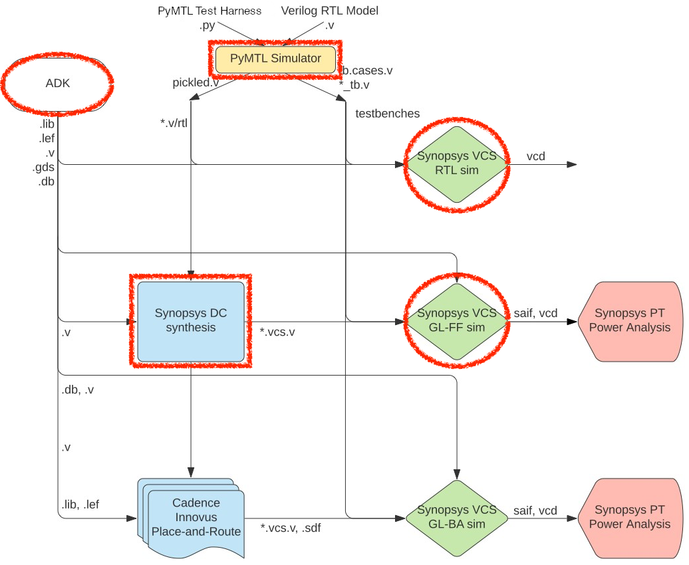

ECE 5745 Section 1: ASIC Flow Front-End
==========================================================================

 - Author: Christopher Batten
 - Date: January 27, 2023

**Table of Contents**

 - Introduction
 - NanGate 45nm Standard-Cell Libraries
 - PyMTL-Based Testing, Simulation, Translation
 - Using Synopsys VCS for 4-State RTL Simulation
 - Using Synopsys Design Compiler for Synthesis
 - Using Synopsys VCS for Fast-Functional Gate-Level Simulation

Introduction
--------------------------------------------------------------------------

In this section, we will be discussing the front-end of the ASIC
toolflow. More detailed tutorials will be posted on the public course
website, but this section will at least give you a chance to edit some
RTL, synthesize that to a gate-level netlist, and then simulate that
gate-level netlist. The following diagram illustrates the tool flow we
will be using in ECE 5745. Notice that the Synopsys and Cadence ASIC
tools all require various views from the standard-cell library which part
of the ASIC design kit (ADK).

The "front-end" of the flow is highlighted in red and refers to
the PyMTL simulator, Synopsys DC, and Synopsys VCS:

 - We write our RTL models in Verilog, and we use the PyMTL framework to
   test, verify, and evaluate the execution time (in cycles) of our
   design. This part of the flow is very similar to the flow used in
   ECE 4750. Once we are sure our design is working correctly, we can
   then start to push the design through the flow.

 - We use Synopsys Design Compiler (DC) to synthesize our design, which
   means to transform the Verilog RTL model into a Verilog gate-level
   netlist where all of the gates are selected from the standard-cell
   library. We need to provide Synopsys DC with abstract logical and
   timing views of the standard-cell library in `.db` format. In addition
   to the Verilog gate-level netlist, Synopsys DC can also generate a
   `.ddc` file which contains information about the gate-level netlist
   and timing, and this `.ddc` file can be inspected using Synopsys
   Design Vision (DV).

 - We use Synopsys VCS for RTL and gate-level simulation. PyMTL uses the
   Verilator two-state RTL simulator meaning every wire will be either a
   0 (logic low) or 1 (logic high). Synopsys VCS uses four-state RTL
   simulation meaning every wire will be either a 0 (logic low), 1 (logic
   high), X (unknown), or Z (floating). Four-state RTL simulation can
   identify different kinds of bugs than two-state simulation such as
   bugs due to uninitialized state. Gate-level simulation involves
   simulating every standard-cell gate and helps verify that the Verilog
   gate-level netlist is functionally correct.

Extensive documentation is provided by Synopsys and Cadence. We have
organized this documentation and made it available to you on the Canvas
course page:

 - <https://www.csl.cornell.edu/courses/ece5745/asicdocs>

The first step is to access `ecelinux`. You can use VS Code for
working at the command line, but you will also need to a remote access
option that supports Linux applications with a GUI such as X2Go,
MobaXterm, or Mac Terminal with XQuartz. Once you are at the `ecelinux`
prompt, source the setup script, clone this repository from GitHub, and
define an environment variable to keep track of the top directory for the
project.

    % source setup-ece5745.sh
    % mkdir -p $HOME/ece5745
    % cd $HOME/ece5745
    % git clone https://github.com/cornell-ece5745/ece5745-S01-front-end sec1
    % cd sec1
    % TOPDIR=$PWD

NanGate 45nm Standard-Cell Libraries
--------------------------------------------------------------------------

A standard-cell library is a collection of combinational and sequential
logic gates that adhere to a standardized set of logical, electrical, and
physical policies. For example, all standard cells are usually the same
height, include pins that align to a predetermined vertical and
horizontal grid, include power/ground rails and nwells in predetermined
locations, and support a predetermined number of drive strengths. In this
course, we will be using the a NanGate 45nm standard-cell library. It is
based on a "fake" 45nm technology. This means you cannot actually tapeout
a design using this standard cell library, but the technology is
representative enough to provide reasonable area, energy, and timing
estimates for teaching purposes. All of the files associated with this
standard cell library are located in the `$ECE5745_STDCELLS` directory.

Let's first look at the data book which is on the Canvas course page:

 - <https://web.csl.cornell.edu/courses/ece5745/resources/nangate-freepdk45nm-stdcell-databook.pdf>

Scroll through the PDF and find the entry for the NAND3_X1 cell (it is on
page 104). The data book provides information on the standard cell's
logic function, delay, area, and power consumption. Let's take a look at
the layout for the same cell.

    % klayout -l $ECE5745_STDCELLS/klayout.lyp $ECE5745_STDCELLS/stdcells.gds

Find the NAND3_X1 cell in the left-hand cell list, and then choose
_Display > Show as New Top_ from the menu. We will learn more about
layout and how this layout corresponds to a static CMOS circuit later in
the course. The key point is that the layout for the standard cells are
the basic building blocks that we will be using to create our ASIC chips.

The Synopsys and Cadence tools do not actually use this layout directly;
it is actually _too_ detailed. Instead these tools use abstract views of
the standard cells, which capture logical functionality, timing,
geometry, and power usage at a much higher level. Let's look at the
Verilog behavioral specification for the 3-input NAND cell.

    % less -p NAND3_X1 $ECE5745_STDCELLS/stdcells.v

Note that the Verilog implementation of the 3-input NAND cell looks
nothing like the Verilog we used in ECE 4750. This cell is implemented
using three Verilog primitive gates (i.e., two `and` gates and one `not`
gate), and it includes a `specify` block which is used for advanced
gate-level simulation with back-annotated delays.

Finally, let's look at an abstract view of the timing and power of the
3-input NAND cell suitable for use by the ASIC flow. This abstract view
is in the `.lib` file for the standard cell library.

    % less -p NAND3_X1 $ECE5745_STDCELLS/stdcells.lib

Now that we have looked at some of the views of the standard cell
library, we can now try using these views and the ASIC flow front-end to
synthesize RTL into a gate-level netlist.

PyMTL-Based Testing, Simulation, Translation
--------------------------------------------------------------------------

Our goal in this section is to generate a gate-level netlist for
the following four-stage registered incrementer:

We will take an incremental design approach. We will start by
implementing and testing a single registered incrementer, and then we
will write a generic multi-stage registered incrementer. For this section
(and indeed the entire course) you will use Verilog for RTL design and
Python for test harnesses, simulation drivers, function-level models, and
cycle-level models.

### Implement, Test, and Translate a Registered Incrementer

Now let's run all of the tests for the registered incrementer:

    % mkdir -p $TOPDIR/sim/build
    % cd $TOPDIR/sim/build
    % pytest ../tut3_verilog/regincr

The tests will fail because we need to finish the implementation. Let's
start by focusing on the basic registered incrementer module.

    % cd $TOPDIR/sim/build
    % pytest ../tut3_verilog/regincr/test/RegIncr_test.py

Use your favorite text editor to open the implementation and uncomment
the actual combinational logic for the increment operation. The Verilog
RTL implementation should look as follows:

    `ifndef TUT3_VERILOG_REGINCR_REG_INCR_V
    `define TUT3_VERILOG_REGINCR_REG_INCR_V

    module tut3_verilog_regincr_RegIncr
    (
      input  logic       clk,
      input  logic       reset,
      input  logic [7:0] in_,
      output logic [7:0] out
    );

      // Sequential logic

      logic [7:0] reg_out;

      always @( posedge clk ) begin
        if ( reset )
          reg_out <= 0;
        else
          reg_out <= in_;
      end

      // Combinational logic

      logic [7:0] temp_wire;

      always @(*) begin
        temp_wire = reg_out + 1;
      end

      // Combinational logic

      assign out = temp_wire;

      // Line tracing

      `ifndef SYNTHESIS

      logic [`VC_TRACE_NBITS-1:0] str;
      `VC_TRACE_BEGIN
      begin
        $sformat( str, "%x (%x) %x", in_, reg_out, out );
        vc_trace.append_str( trace_str, str );
      end
      `VC_TRACE_END

      `endif /* SYNTHESIS */

    endmodule

    `endif /* TUT3_VERILOG_REGINCR_REG_INCR_V */

If you have an error you can use a trace-back to get a more detailed
error message:

    % cd $TOPDIR/sim/build
    % pytest ../tut3_verilog/regincr/test/RegIncr_test.py --tb=long

Once you have finished the implementation let's rerun the tests:

    % cd $TOPDIR/sim/build
    % pytest ../tut3_verilog/regincr/test/RegIncr_test.py -sv

The `-v` command line option tells `pytest` to be more verbose in its
output and the `-s` command line option tells `pytest` to print out the
line tracing. Make sure you understand the line tracing output. You can
also dump VCD files using `--dump-vcd` for waveform debugging with
`gtkwave`:

    % cd $TOPDIR/sim/build
    % pytest ../tut3_verilog/regincr/test/RegIncr_test.py -sv --dump-vcd
    % gtkwave regincr.test.RegIncr_test__test_small_top.verilator1.vcd &

PyMTL takes care of including all Verilog dependencies into a single
Verilog file (also called "pickling") suitable for use with the ASIC
flow. Take a look at the generated pickled Verilog file.

    % cd $TOPDIR/sim/build
    % less RegIncr_noparam__pickled.v

### Implement, Test, and Translate Multi-Stage Registered Incrementer

Now let's work on composing a single registered incrementer into a
multi-stage registered incrementer. We will be using _static elaboration_
to make the multi-stage registered incrementer _generic_. In other words,
our design will be parameterized by the number of stages so we can easily
generate a pipeline with one stage, two stages, four stages, etc. Let's
start by running all of the tests for the multi-stage registered
incrementer.

    % cd $TOPDIR/sim/build
    % pytest ../tut3_verilog/regincr/test/RegIncrNstage_test.py

Use your favorite text editor to open the implementation and uncomment
the static elabroation logic to instantiate a pipeline of registered
incrementers. The Verilog RTL implementation should look as follows:

    `ifndef TUT3_VERILOG_REGINCR_REG_INCR_NSTAGE_V
    `define TUT3_VERILOG_REGINCR_REG_INCR_NSTAGE_V

    `include "tut3_verilog/regincr/RegIncr.v"

    module tut3_verilog_regincr_RegIncrNstage
    #(
      parameter nstages = 2
    )(
      input  logic       clk,
      input  logic       reset,
      input  logic [7:0] in_,
      output logic [7:0] out
    );

      // This defines an _array_ of signals. There are p_nstages+1 signals
      // and each signal is 8 bits wide. We will use this array of
      // signals to hold the output of each registered incrementer stage.

      logic [7:0] reg_incr_out [nstages+1];

      // Connect the input port of the module to the first signal in the
      // reg_incr_out signal array.

      assign reg_incr_out[0] = in_;

      // Instantiate the registered incrementers and make the connections
      // between them using a generate block.

      genvar i;
      generate
      for ( i = 0; i < nstages; i = i + 1 ) begin: gen

        tut3_verilog_regincr_RegIncr reg_incr
        (
          .clk   (clk),
          .reset (reset),
          .in_   (reg_incr_out[i]),
          .out   (reg_incr_out[i+1])
        );

      end
      endgenerate

      // Connect the last signal in the reg_incr_out signal array to the
      // output port of the module.

      assign out = reg_incr_out[nstages];

    endmodule

    `endif /* TUT3_VERILOG_REGINCR_REG_INCR_NSTAGE_V */

Before re-running the tests, let's take a look at how we are doing the
testing in the corresponding test script. Use your favorite text editor
to open up `RegIncrNstage_test.py`. Notice how PyMTL enables
sophisticated testing for highly parameterized components. The test
script includes directed tests for two and three stage pipelines with
various small, large, and random values, and also includes random testing
with 1, 2, 3, 4, 5, 6 stages. Writing a similar test harness in Verilog
would likely require 10x more code and be significantly more tedious!

Let's re-run a single test and use line tracing to see the data moving
through the pipeline:

    % cd $TOPDIR/sim/build
    % pytest ../tut3_verilog/regincr/test/RegIncrNstage_test.py -sv -k test_random[4]

And now let's run all of the tests:

    % cd $TOPDIR/sim/build
    % pytest ../tut3_verilog/regincr/test/RegIncrNstage_test.py -sv
    % ls *.v
    % less RegIncrNstage__p_nstages_4__pickled.v

Notice how PyMTL3 has generated a wrapper which picks a specific
parameter value for this instance of the multi-stage registered
incrementer.

Finally, we are going to run all of the tests with the `--test-verilog`
and `--dump-vtb` options which will generate a Verilog test-bench that
can then be used for RTL and gate-level simulation.

    % cd $TOPDIR/sim/build
    % pytest ../tut3_verilog/regincr/test/RegIncrNstage_test.py --test-verilog --dump-vtb
    % ls *.v
    % less RegIncrNstage__p_nstages_4_test_random_4_tb.v
    % less RegIncrNstage__p_nstages_4_test_random_4_tb.v.cases

### Simulate Multi-Stage Registered Incrementer

Test scripts are great for verification, but when we want to push a
design through the flow we usually want to use a simulator to drive that
process. A simulator is meant for evaluting the area, energy, and
performance of a design as opposed to verification. We have included a
simple simulator called `regincr-sim` which takes a list of values on the
command line and sends these values through the pipeline. Let's see the
simulator in action:

    % cd $TOPDIR/sim/build
    % ../tut3_verilog/regincr/regincr-sim 0x10 0x20 0x30 0x40
    % less RegIncr4stage__pickled.v

We now have the Verilog RTL that we want push through the next step in
the ASIC front-end flow.

Using Synopsys VCS for 4-State RTL Simulation
--------------------------------------------------------------------------

Recall that PyMTL3 simulation of Verilog RTL uses Verilator which is a
two-state simulator. To help catch bugs due to uninitialized state (and
also just to help verify the design using another Verilog simulator), we
can use Synopsys VCS for four-state RTL simulation. This simulator will
make use of the Verilog test-bench generated by the `--test-verilog` and
`--dump-vtb` options from earlier (although we could also write our own
Verilog test-bench from scratch). Here is how to run VCS for RTL
simulation:

    % mkdir -p $TOPDIR/asic/synopsys-vcs-rtl-sim
    % cd $TOPDIR/asic/synopsys-vcs-rtl-sim
    % vcs -full64 -sverilog +lint=all -xprop=tmerge -override_timescale=1ns/1ps \
        +incdir+../../sim/build \
        +vcs+dumpvars+vcs-rtl-sim.vcd \
        -top RegIncrNstage__p_nstages_4_tb \
        ../../sim/build/RegIncrNstage__p_nstages_4__pickled.v \
        ../../sim/build/RegIncrNstage__p_nstages_4_test_random_4_tb.v

This is a pretty long command line! We will go over some of these options
in the discussion section. However, we also provide you a shell script
that has the command ready for you to use.

    % cd $TOPDIR/asic/synopsys-vcs-rtl-sim
    % source run.sh
    % ls

You should see a `simv` binary which is the compiled RTL simulator which
you can run like this:

    % cd $TOPDIR/asic/synopsys-vcs-rtl-sim
    % ./simv

It should pass the test. Now let's look at the resulting waveforms.

    % gtkwave vcs-rtl-sim.vcd

Browse the signal hierarchy and view the waveforms for one of the four
registered incrementers. Note how the signals are initialized to X and
only become 0 or 1 after a few cycles once we come out of reset. If we
improperly used an initialized value then we would see X-propagation
which would hopefully cause a failing test case.

Using Synopsys Design Compiler for Synthesis
--------------------------------------------------------------------------

We use Synopsys Design Compiler (DC) to synthesize Verilog RTL models
into a gate-level netlist where all of the gates are from the standard
cell library. So Synopsys DC will synthesize the Verilog + operator into
a specific arithmetic block at the gate-level. Based on various
constraints it may synthesize a ripple-carry adder, a carry-look-ahead
adder, or even more advanced parallel-prefix adders.

We start by creating a subdirectory for our work, and then launching
Synopsys DC.

    % mkdir -p $TOPDIR/asic/synopsys-dc-synth
    % cd $TOPDIR/asic/synopsys-dc-synth
    % dc_shell-xg-t

We need to set two variables before starting to work in Synopsys DC.
These variables tell Synopsys DC the location of the standard cell
library `.db` file which is just a binary version of the `.lib` file we
saw earlier.

       dc_shell> set_app_var target_library "$env(ECE5745_STDCELLS)/stdcells.db"
       dc_shell> set_app_var link_library   "* $env(ECE5745_STDCELLS)/stdcells.db"

We are now ready to read in the Verilog file which contains the top-level
design and all referenced modules. We do this with two commands. The
analyze command reads the Verilog RTL into an intermediate internal
representation. The elaborate command recursively resolves all of the
module references starting from the top-level module, and also infers
various registers and/or advanced data-path components.

    dc_shell> analyze -format sverilog ../../sim/build/RegIncrNstage__p_nstages_4__pickled.v
    dc_shell> elaborate RegIncrNstage__p_nstages_4

We can use the `check_design` command to make sure there are no obvious
errors in our Verilog RTL.

    dc_shell> check_design

It is _critical_ that you review all warnings. Often times there will be
something very wrong in your Verilog RTL which means any results from
using the ASIC tools is completely bogus. Synopsys DC will output a
warning, but Synopsys DC will usually just keep going, potentially
producing a completely incorrect gate-level model!

We now need to create a clock constraint to tell Synopsys DC what our
target cycle time is:

    dc_shell> create_clock clk -name ideal_clock1 -period 1

Finaly, the `compile` comamnd will do the actual logic synthesis:

    dc_shell> compile

We write the output to a Verilog gate-level netlist and a `.ddc` file
which we can use with Synopsys DV.

    dc_shell> write -format verilog -hierarchy -output post-synth.v
    dc_shell> write -format ddc     -hierarchy -output post-synth.ddc

We can also generate usful reports about area, energy, and timing. Prof.
Batten will spend some time explaining these reports:

    dc_shell> report_resources -nosplit -hierarchy
    dc_shell> report_timing -nosplit -transition_time -nets -attributes
    dc_shell> report_area -nosplit -hierarchy
    dc_shell> report_power -nosplit -hierarchy

Make some notes about what you find. Note the total cell area used in
this design. Finally, we go ahead and exit Synopsys DC.

    dc_shell> exit

Take a few minutes to examine the resulting Verilog gate-level netlist.
Notice that the module hierarchy is preserved.

    % less post-synth.v

Take a close look at the implementation of the incrementer. What kind of
standard cells has the synthesis tool chosen? What kind of adder
microarchitecture?

We can use the Synopsys Design Vision (DV) tool for browsing the
resulting gate-level netlist, plotting critical path histograms, and
generally analyzing our design. Start Synopsys DV and setup the
`target_library` and `link_library` variables as before.

    % design_vision-xg
    design_vision> set_app_var target_library "$env(ECE5745_STDCELLS)/stdcells.db"
    design_vision> set_app_var link_library   "* $env(ECE5745_STDCELLS)/stdcells.db"

You can use the following steps to open the `.ddc` file generated during
synthesis.

 - Choose _File > Read_ from the menu
 - Open the `post-synth.dcc` file

You can use the following steps to view the gate-level schematic for the
design.:

 - Select the `RegIncrNstage__p_nstages_4` module in the _Logical Hierarchy_ panel
 - Choose _Select > Cells > Leaf Cells of Selected Cells_ from the menu
 - Choose _Schematic > New Schematic View_ from the menu
 - Choose _Select > Clear_ from the menu

You can use the _Logical Hierarchy_ browser to highlight modules in the
schematic view. If you click on the drop down you can choose _Cells
(All)_ instead of _Cells (Hierarchical)_ to browse the standard cells as
well. You can determine the type of module or gate by selecting the
module or gate and choosing _Edit > Properties_ from the menu. Then look
for `ref_name`. You should be able to see the schematic for eaech stage
of the pipline including the flip-flops and and the add module. See if
you can figure out why the synthesis tool has inserted AND gates in front
of each flip-flop. If you look inside the `add` module you should be able
to see the adder microarchitecture.

You can use the following steps to view a histogram of path slack, and
also to open a gave-level schematic of just the critical path.

 - Choose _Timing > Path Slack_ from the menu
 - Click _OK_ in the pop-up window
 - Select the left-most bar in the histogram to see list of most critical paths
 - Select one of the paths in the path list to highlight the path in the schematic view

Using Synopsys VCS for Fast-Functional Gate-Level Simulation
--------------------------------------------------------------------------

Good ASIC designers are always paranoid and _never_ trust their tools.
How do we know that the synthesized gate-level netlist is correct? One
way we can check is to rerun our test suite on the gate-level model. We
can do this using Synopsys VCS for fast-functional gatel-level
simulation. _Fast-functional_ refers to the fact that this simulation
will not take account any of the gate delays. All gates will take zero
time and all signals will still change on the rising clock edge just like
in RTL simulation. Here is how to run VCS for RTL simulation:

    % cd $TOPDIR/asic/synopsys-vcs-ffgl-sim
    % vcs -full64 -sverilog +lint=all -xprop=tmerge -override_timescale=1ns/1ps \
        +delay_mode_zero \
        +incdir+../../sim/build \
        +vcs+dumpvars+vcs-ffgl-sim.vcd \
        -top RegIncrNstage__p_nstages_4_tb \
        $ECE5745_STDCELLS/stdcells.v \
        ../synopsys-dc-synth/post-synth.v \
        ../../sim/build/RegIncrNstage__p_nstages_4_test_random_4_tb.v

This is a pretty long command line! So we provide you a shell script that
has the command ready for you to use.

    % cd $TOPDIR/asic/synopsys-vcs-ffgl-sim
    % source run.sh

You should see a `simv` binary which is the compiled RTL simulator which
you can run like this:

    % cd $TOPDIR/asic/synopsys-vcs-ffgl-sim
    % ./simv

It should pass the test. Now let's look at the resulting waveforms.

    % cd $TOPDIR/asic/synopsys-vcs-ffgl-sim
    % gtkwave vcs-ffgl-sim.vcd

Browse the signal hierarchy and display all the waveforms for a subset of
the gate-level netlist using these steps:

 - Expand out the signal tree until you find an _add_ module
 - Right click on the _add_ module and choose _Recurse Import > Append_

Notice how we can see all of the single-bit signals corresponding to each
gate in the gate-level netlist, and how these signals all change on the
rising clock edge without any delays.

To-Do On Your Own
--------------------------------------------------------------------------

If you have time, push the multi-stage registered incrementer through the
flow again, but this type use a faster clock constraint. This will force
the tools to be more agress as they attempt to "meet timing". Try using a
clock constraint of 0.3ns instead of 1ns. Use `report_resources` to
determine what kind of adder microarchitecture the synthesis tool has
chosen. Use `report_timing` to see if the tool is able to generate a
gate-level netlist that can really run at 333MHz. Use `report_area` to
compare the area of the design with the 0.3ns clock constraint to the
design with the 1ns clock constraint. Use Synopsys DV to visualize the
improved adder microarchitecture.

