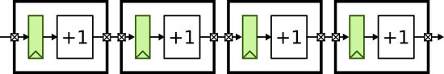

ECE 5745 Section 1: ASIC Flow Front-End
==========================================================================

 - Author: Christopher Batten
 - Date: January 24, 2019

**Table of Contents**

 - Introduction
 - NanGate 45nm Standard-Cell Libraries
 - PyMTL-Based Testing, Simulation, Translation
 - Using Synopsys Design Compiler for Synthesis

Introduction
--------------------------------------------------------------------------

In this section, we will be discussing the front-end of the ASIC
toolflow. More detailed tutorials will be posted on the public course
website shortly, but this section will at least give you a chance to edit
some RTL and synthesize that to a gate-level netlist. The following
diagram illustrates the four primary tools we will be using in ECE 5745
along with a few smaller secondary tools. Notice that the Synopsys and
Cadence ASIC tools all require various views from the standard-cell
library. The "front-end" of the flow refers to the PyMTL simulator and
Synopsys DC.


 1. We use the PyMTL framework to test, verify, and evaluate the
    execution time (in cycles) of our design. This part of the flow is
    very similar to the flow used in ECE 4750. Note that we can write our
    RTL models in either PyMTL or Verilog. Once we are sure our design is
    working correctly, we can then start to push the design through the
    flow. The ASIC flow requires Verilog RTL as an input, so we can use
    PyMTL's automatic translation tool to translate PyMTL RTL models into
    Verilog RTL.

 2. We use Synopsys Design Compiler (DC) to synthesize our design, which
    means to transform the Verilog RTL model into a Verilog gate-level
    netlist where all of the gates are selected from the standard-cell
    library. We need to provide Synopsys DC with abstract logical and
    timing views of the standard-cell library in `.db` format. In
    addition to the Verilog gate-level netlist, Synopsys DC can also
    generate a `.ddc` file which contains information about the
    gate-level netlist and timing, and this `.ddc` file can be inspected
    using Synopsys Design Vision (DV).

Extensive documentation is provided by Synopsys and Cadence. We have
organized this documentation and made it available to you on the [public
course webpage](http://www.csl.cornell.edu/courses/ece5745/syndocs). The
username/password was distributed during lecture.

The first step is to source the setup script, clone this repository from
GitHub, and define an environment variable to keep track of the top
directory for the project.

```
 % source setup-ece5745.sh
 % mkdir $HOME/ece5745
 % cd $HOME/ece5745
 % git clone git@github.com:cornell-ece5745/ece5745-S01-front-end
 % cd ece5745-S01-front-end
 % TOPDIR=$PWD
```

NanGate 45nm Standard-Cell Libraries
--------------------------------------------------------------------------

A standard-cell library is a collection of combinational and sequential
logic gates that adhere to a standardized set of logical, electrical, and
physical policies. For example, all standard cells are usually the same
height, include pins that align to a predetermined vertical and
horizontal grid, include power/ground rails and nwells in predetermined
locations, and support a predetermined number of drive strengths. In this
course, we will be using the a NanGate 45nm standard-cell library. It is
based on a "fake" 45nm technology. This means you cannot actually tapeout
a design using this standard cell library, but the technology is
representative enough to provide reasonable area, energy, and timing
estimates for teaching purposes. All of the files associated with this
standard cell library are located in the `$ECE5745_STDCELLS` directory.

Let's take a look at some layout for some cells.

```
 % klayout -l $ECE5745_STDCELLS/klayout.lyp $ECE5745_STDCELLS/stdcells.gds
```

Let's look at a 3-input NAND cell, find the NAND3_X1 cell in the
left-hand cell list, and then choose _Display > Show as New Top_ from the
menu. We will learn more about layout and how this layout corresponds to
a static CMOS circuit later in the course. The key point is that this
layout is a basic building block that we will be using to create our ASIC
chips.

The Synopsys and Cadence tools do not actually use this layout directly;
it is actually _too_ detailed. Instead these tools use abstract views of
the standard cells, which capture logical functionality, timing,
geometry, and power usage at a much higher level. Let's look at the
Verilog behavior specification for the 3-input NAND cell.

```
 % less -p NAND3_X1 $ECE5745_STDCELLS/stdcells.v
```

Note that the Verilog implementation of the 3-input NAND cell looks
nothing like the Verilog we used in ECE 4750. This cell is implemented
using a Verilog primitive gate (i.e., `nand`), it includes a delay value
of one delay unit (i.e., `#1`), and it includes a `specify` block which
is used for advanced gate-level simulation with back-annotated delays.

Finally, let's look at an abstract view of the timing and power of the
3-input NAND cell suitable for use by the ASIC This abstract view is in
the `.lib` file for the standard cell library.

```
 % less -p NAND3_X1 $ECE5745_STDCELLS/stdcells.lib
```

Now that we have looked at some of the views of the standard cell
library, we can now try using these views and the ASIC flow front-end to
synthesize RTL into a gate-level net list.

PyMTL-Based Testing, Simulation, Translation
--------------------------------------------------------------------------

Our goal in this section is to generate a gate-level netlist for
the following four-stage registered incrementer:



We will take an incremental design approach. We will start by
implementing and testing a single registered incrementer, and then we
will write a generic multi-stage registered incrementer. For this section
(and indeed the entire course) your test harnesses, simulation drivers,
function-level models, and cycle-level models will all be written in
PyMTL. However, you are free to do your actual RTL design work in either
PyMTL or Verilog. Prof. Batten will now spend a few minutes explaining
how PyMTL works.

### Choose RTL Design Language

So the first step is to decide if you want to do this section using PyMTL
or Verilog. All you need to do is edit these two files using `geany` or
your favorite text editor:

```
 % geany $TOPDIR/sim/regincr/RegIncrRTL.py
 % geany $TOPDIR/sim/regincr/RegIncrNstageRTL.py
```

Set the `rtl_language` variable to `verilog` if you want to use Verilog
for your RTL design and set it to `pymtl` if you want to use PyMTL for
your RTL design. For example, this is what it would look like to use
`verilog`:

```
rtl_language = 'verilog'
```

### Implement, Test, and Translate Single Registered Incrementer

Now let's run all of the tests for the registered incrementer:

```
 % mkdir $TOPDIR/sim/build
 % cd $TOPDIR/sim/build
 % py.test ../regincr
```

The tests will fail because we need to finish the implementation. Let's
start by focusing on the registered incrementer.

```
 % cd $TOPDIR/sim/build
 % py.test ../regincr/RegIncrRTL_test.py
```

Use `geany` or your favorite text editor to open the implementation and
add the actual combinational logic for the increment operation. So for a
PyMTL implementation you should edit `RegIncrPRTL.py` to look as follows:

```
from pymtl import *

class RegIncrPRTL( Model ):

  # Constructor

  def __init__( s ):

    # Port-based interface

    s.in_ = InPort  ( Bits(8) )
    s.out = OutPort ( Bits(8) )

    # Sequential logic

    s.reg_out = Wire( Bits(8) )

    @s.tick_rtl
    def block1():
      if s.reset:
        s.reg_out.next = 0
      else:
        s.reg_out.next = s.in_

    # Combinational logic

    @s.combinational
    def block2():
      s.out.value = s.reg_out + 1

  def line_trace( s ):
    return "{} ({}) {}".format( s.in_, s.reg_out, s.out )
```

For a Verilog implementation you should edit `RegIncrVRTL.py` to look as
follows:

```
`ifndef REG_INCR_V
`define REG_INCR_V

module RegIncrVRTL
(
  input  logic       clk,
  input  logic       reset,
  input  logic [7:0] in,
  output logic [7:0] out
);

  // Sequential logic

  logic [7:0] reg_out;
  always @( posedge clk ) begin
    if ( reset )
      reg_out <= 0;
    else
      reg_out <= in;
  end

  // Combinational logic

  logic [7:0] temp_wire;
  always @(*) begin
    temp_wire = reg_out + 1;
  end

  // Combinational logic

  assign out = temp_wire;

endmodule

`endif /* REG_INCR_V */
```

If you have an error you can use a trace-back to get a more detailed
error message:

```
 % cd $TOPDIR/sim/build
 % py.test ../regincr/RegIncrRTL_test.py --tb=long
```

Once you have finished the implementation let's rerun the tests:

```
 % cd $TOPDIR/sim/build
 % py.test ../regincr/RegIncrRTL_test.py -sv
```

Let's add some more tests. Use `geany` or your favorite text editor to
open the test script named `RegIncrRTL_test.py`. PyMTL provides lots of
helper utilities to make testing more productive. For example, the
`run_test_vector_sim` helper function makes it easy to test a small RTL
component. Add a new test case for larger inputs by adding the following
to the end of the test script:

```
def test_large( dump_vcd, test_verilog ):
  run_test_vector_sim( RegIncrRTL(), [
    ('in_   out*'),
    [ 0xa0, '?'  ],
    [ 0xb3, 0xa1 ],
    [ 0xc6, 0xb4 ],
    [ 0x00, 0xc7 ],
  ], dump_vcd, test_verilog )
```

Now rerun the tests:

```
 % cd $TOPDIR/sim/build
 % py.test ../regincr/RegIncrRTL_test.py -sv
```

PyMTL supports automatically translating PyMTL RTL into Verilog RTL so we
can then use that Verilog RTL with the ASIC flow. To test the translated
verilog you can use the `--test-verilog` command line option:

```
 % cd $TOPDIR/sim/build
 % py.test ../regincr/RegIncrRTL_test.py --test-verilog
 % more *.v
```

Take a look at the generated Verilog; hopefully it should be clear the
one-to-one mapping from PyMTL RTL to Verilog RTL.

### Implement, Test, and Translate Multi-Stage Registered Incrementer

### Simulate Multi-Stage Registered Incrementer

Using Synopsys Design Compiler for Synthesis
--------------------------------------------------------------------------

 % mkdir $TOPDIR/asic
 % cd $TOPDIR/asic
 % dc_shell-xg-t

 dc_shell> alias "dc_shell>" ""

 dc_shell> set_app_var target_library "$env(ECE5745_STDCELLS)/stdcells.db"
 dc_shell> set_app_var link_library   "* $env(ECE5745_STDCELLS)/stdcells.db"

 dc_shell> analyze -format sverilog ../sim/build/RegIncrNstageRTL_4stage.v

 dc_shell> elaborate RegIncrNstageRTL_4stage

 dc_shell> check_design

 dc_shell> create_clock clk -name ideal_clock1 -period 1

 dc_shell> compile

 dc_shell> write -format verilog -hierarchy -output post-synth.v

 dc_shell> write -format ddc     -hierarchy -output post-synth.ddc

 dc_shell> report_timing -nosplit -transition_time -nets -attributes

 dc_shell> report_area -nosplit -hierarchy
 dc_shell> report_power -nosplit -hierarchy
 dc_shell> exit

 % more post-synth.v

 % design_vision-xg
 design_vision> set_app_var target_library "$env(ECE5745_STDCELLS)/stdcells.db"
 design_vision> set_app_var link_library   "* $env(ECE5745_STDCELLS)/stdcells.db"


